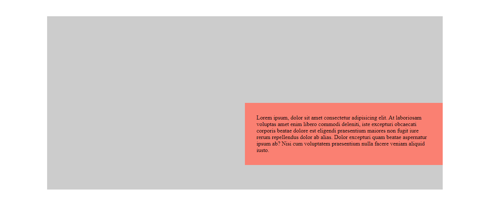

# Centrado vertical y horizontal cuando el alto y ancho es desconocido

En el ejemplo anterior, vimos como centrar un elemento dentro de su contenedor cuando sus dimensiones son conocidas, en este ejemplo vamos a hacerlo cuando sus dimensiones son desconocidas, es decir, cuando sus dimensiones vienen determinadas por su contenido y este contendido puede ser diferente, provenir de una base de datos, etc.

Partimos inicalmene del mismo html, pero con un texto más o menos grande en el interior de la caja ".box", además solamente fijamos su ancho al 50% de manera que la caja pueda crecer en altura más o menos en función del contenido

```html
<div class="wrapper">
    <div class="box">Lorem ipsum, dolor sit amet consectetur adipisicing elit. At laboriosam voluptas amet enim libero commodi deleniti, iste excepturi obcaecati corporis beatae dolore est eligendi praesentium maiores non fugit iure rerum repellendus dolor ab alias. Dolor excepturi quam beatae aspernatur ipsum ab? Nisi cum voluptatem praesentium nulla facere veniam aliquid iusto.</div>
</div>
```


```scss
.wrapper {
    width: 80%;
    background-color: rgba(0,0,0,.2);
    height: 30rem;
    margin: 3rem auto;
}

.box {
    background-color: salmon;
    width: 50%;
    padding: 2em;
}
```

Al igual que en el [ejemplo anterior](../0706-EJ/) utilizamos la propiedad **position: absolute** para posicionarlo en el centro mediante **top y left al 50%**, teniendo en cuenta que es necesario establecer **position: relative** al padre



```scss
.wrapper {
    ...
    position: relative;
}

.box {
    ...
    position: absolute;
    top: 50%;
    left: 50%;
}
```

Y como en el ejemplo anterior el elemento no nos queda correctamente centrado, es necesario, desplazarlo hacia arriba y hacia la izquierda la mitad de sus dimensiones, sin embargo, en esta ocasión no conocemos su dimensión en algura, ya que irá creciendo hacia abajo a medida que disminuyamos su anchura


Para solucionar este problema podemos utilizar la propiedad **transform: translateX()** y **trasform: translateY()** o su sortcut **transform: translate(x, y)**
En esta propiedad, si establecermos el desplazamiento en procentajes, este porcentaje, será en función de las dimensiones del elemento y no de su padre, variando además dinámicamente en función del tamaño del elemento ".box"

```scss
.wrapper {
    ...
    position: relative;
}

.box {
    ...
    position: absolute;
    top: 50%;
    left: 50%;
    transform: translate(-50%, -50%); // X e Y respectivamente
}
```


