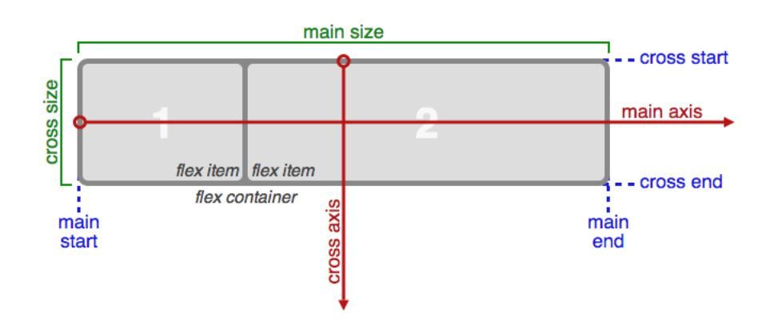
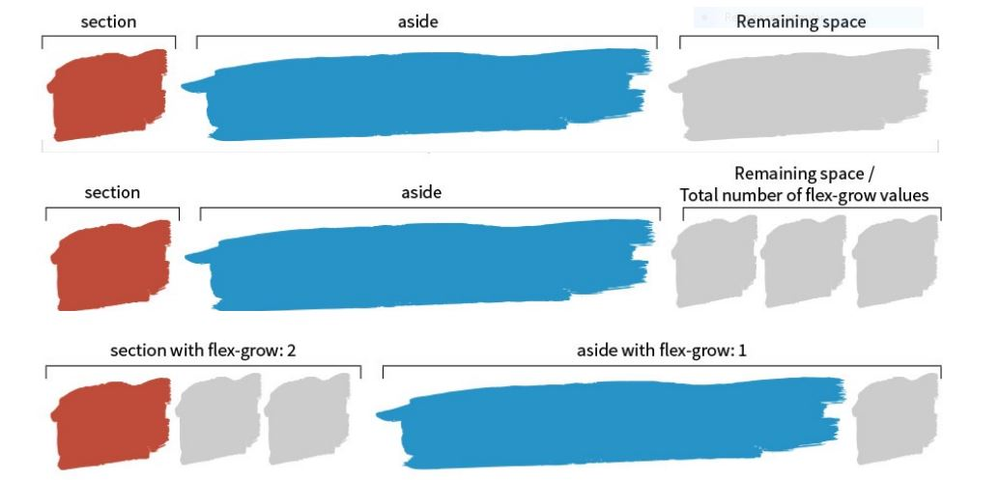

# Que es FLEXBOX

- Flexbox es un módulo completo de layout, es decir, define como se muestran los elementos y como se relacionan con el resto
- El contenedor va a poder modificar las dimensiones y el orden de los items para acomodarlos según nuestras indicaciones

## Que cosas podemos hacer con flexbox

- Alineación vertical
- Columnas de igual altura independientemente del contenido
- Cambiar el orden en el que se muestran los elementos sin que cambie el HTML
- ...

## Introducción

Más información pincha [aqui](https://css-tricks.com/snippets/css/a-guide-to-flexbox/)  
[Otro link intersante](https://codepen.io/enxaneta/full/adLPwv)

## Como se respetan el tamaño de los items

- CROSS SIZE (Eje secundario)
  - Si se ha definido (por width o height), este tamaño se respetará
  - Si no se ha definido, se utilizará todo el espacio disponible (stretch)
  - Si no se ha definido y se utiliza un valor diferente de stretch para align-content o align-items en el contenedor, se tomará el tamaño de su contenido
- MAIN SIZE (Eje principal)
  - Si no se ha definido tamaño se calculará según su contenido
  - Si se ha definido (por width o por height) esté podría respetarse, podría encogerse o podría crecer

## Propiedades del contentendor

- flex-direction: **row**|row-reverse|column|column-reverse
- flex-wrap: **nowrap**|wrap|wrap-reverse
- justify-content: **flex-start**|flex-end|space-between|center|space-around
- align-items: flex-start|flex-end|center|baseline|**stretch**
- align-content: flex-start|flex-end|center|space-between|space-around|**stretch**

## Propiedades de los items

- flex-basis. Es el tamaño base que se considera para los cálculos, **no el tamaño definitivo**, es decir, que podrá variar (crecer o encogerse), según los valores de **flex-grow**, **flex-shrink** y **el tamaño del contenedor**
**Importante:**
  - Flex basis siempre gana a width o height
  - Si no se define **flex-basis** o se establece auto, se tomará en cuenta el valor de width o height, o el tamaño del contenido si no se ha definido. Eso no significa que se respete sino que como flex-basis se tomarán esos
  - Flex-basis no siempre controla el ancho, en flex-direction: column, flex-basis controla el alto
  - Flex-basis solo funciona sobre el main-axis, de modo que si estoy trabajando con **flex-direction: column**, tendré que especificar width si quiero establecerlo
  - Si utilizo la propiedad **flex** que es el shorthand de [flex-grow][flex-shrink][flex-basis], sobrescribiré width sin darme cuenta
  - En responsive es fácil que cambie **flex-direction** de row a column, si establezco width tendré problemas
- flex-grow (crecimiento).
  - Controla cuánto crece un elemento para rellenar el espacio sobrante
  - Solo se aplica si hay espacio disponible
  - Es un número positivo, es decir, se especifican las unidades en las que crecera
  - UNIDAD = ESPACIO DISPONIBLE / SUMA DE FLEX-GROWS EN LA MISMA LÍNEA
  
  [Fuente](https://css-tricks.com/flex-grow-is-weird/)
- flex-shrink (estrechamiento)
  - Si el espacio disponible es negativo (el tamaño del contenedor es menor a la suma de los tamaños de los items), por defecto los items se encogen en proporciones iguales para caber en una sola línea, pero respetando el contenido o si tiene establecido min-width o min-height
  - UNIDAD = ESPACIO DISPONIBLE (SERÁ NEGATIVO) / SUMA DE FLEX-SHRINK EN LA MISMA LÍNEA
- order
  - Cambia el orden de colocación que correspondería según su orden en el HTML (parecido a como funciona z-index).
  - Valores positivos y negativos
  - Positivos al final de la pila, negativos al principio
  
## Espacio ocupado y espacio disponible

- **Espacio ocupado:** Es la suma los main-size de todos los flex-items en la misma línea, más los márgenes si los tienen
- **Espacio disponible:** Es la diferencia entre el tamaño del contenedor y el espacio ocupado. Puede ser positivo (sobra espacio) o negativo (el espacio de los items es mayor que el del contenedor)
- **Si no hay ancho suficiente**, por defecto los items encogen para caber dentro del contenedor (los margenes nunca colapsan)
- **Si hay espacio suficiente**, por defecto los items no crecen, porque flexbox quiere que le digamos como queremos que crezcan

## Ejemplos

1. [Ejemplo con propiedades display: flex y display: inline-flex](./0801-EJ)
2. [Ejemplos con propiedades flex-direction, flex-wrap, justify-content, align-items, align-content](./0802-EJ)
3. [Ejemplo real de total de factura con propiedades justify-content: space-between y align-items: center](./0803-EJ)
4. [Ejemplo real de menu vertical con iconos con on propiedades justify-content: space-between y align-items: center](./0804-EJ)
5. [Ejemplo real de centrado vertical mediante flexbox](./0805-EJ)
6. [Ejemplo real de menu horizontal mediante flexbox](./0806-EJ)
7. [Ejemplo sobre cambio de tamaño de los items de un contenedor](./0807-EJ)
