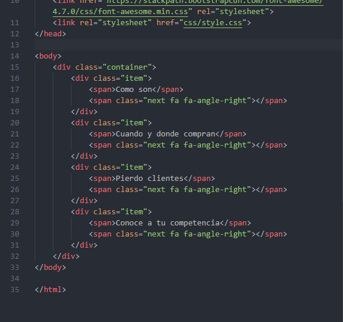

# EXTENSIONES ÚTILES PARA _VS CODE_

1. [Bracket Pair Colorizer 2](https://marketplace.visualstudio.com/items?itemName=CoenraadS.bracket-pair-colorizer-2).
    
    Esta extensión nos permite diferenciar facilmente los bloques de código y los parentesis gracias a que los colorea.

    

    
    
    

2. [CSS Peek](https://marketplace.visualstudio.com/items?itemName=pranaygp.vscode-css-peek).
    
    Esta extensión nos permite ver los estilos css asociados a las etiquetas sin necesidad de ir a buscarlo al archivo css simplemente poniendo el puntero sobre la propiedad mientras mantienes la tecla __control__.

    

    

    

3. [Pola Code](https://marketplace.visualstudio.com/items?itemName=jeff-hykin.polacode-2019).

    Esta extensión nos permite realizar capturas de codigo simplemente seleccionando el codigo con el cursor. Para utilizarla solo tienes que abrirla desde __F1__, seleccionar el codigo a capturar y darle al botón de capturar.

    

    

    

4. [Better Comments](https://marketplace.visualstudio.com/items?itemName=aaron-bond.better-comments).

    Esta extensión nos permite colorear los comentarios del codigo dependiendo del nivel de importancia de este.

    

    

    
