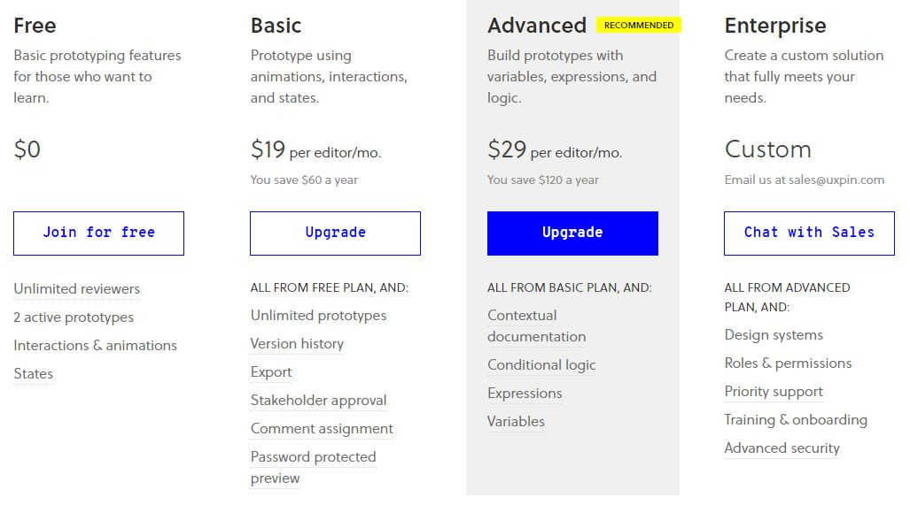
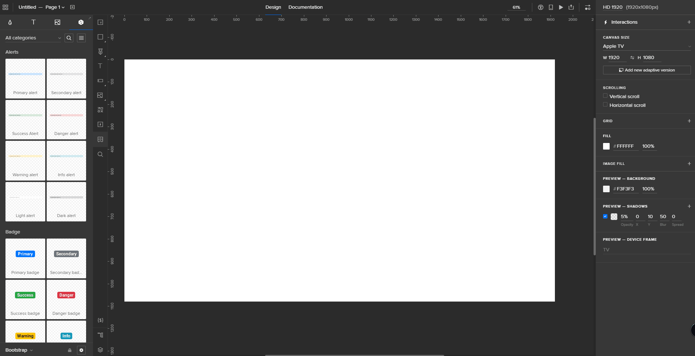
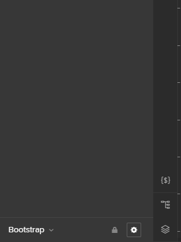
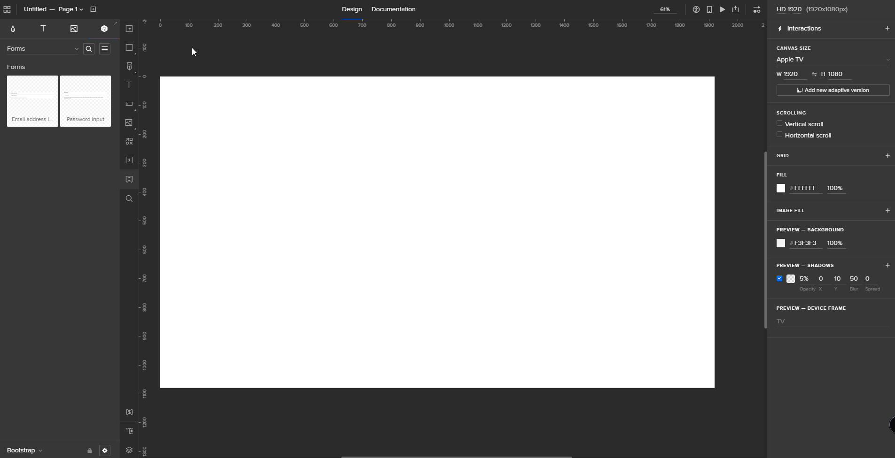
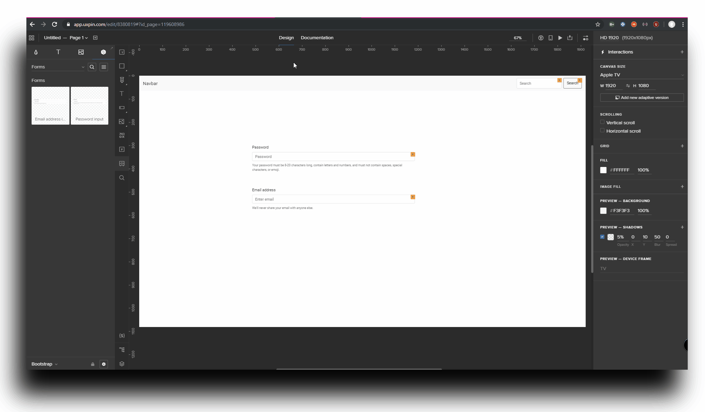

# UXPin

UXPin es una aplicación pensada para el diseño web que además permite simular todas las acciones del usuario por la aplicación que estamos desarrollando.
Está disponible en versión de escritorio o versión del navegador.
Posee la versión gratuita con ciertas limitaciones y varias versiones de pago, las cuales puedes hacer a medida dependiendo de los recursos que necesites para llevar a cabo tu proyecto.

## Funcionalidades

- Editor de wireframes.
- Editor de HTML con prototipos interactivos.
- Conversión de prototipos en papel en wireframes digitales.
- Exportación a HTML.
- Almacenamiento en la nube.
- Control de versiones.
- Permite la colaboración en tiempo real (mediante Google Docs).
- Disponible multiplataforma (IOS, Android, Windows, macOs).

## Uso

### Lienzo

Puedes definir el tamaño que desees para el lienzo donde vas a comenzar a diseñar tu aplicación (10 000px de límite). Junto al lienzo hay un menú en el que puedes definir:

- Si quieres permitir el _scrolling_ tanto vertical como horizontal.
- El color del lienzo.
- Imagen de fondo del lienzo.
- Tamaño del lienzo.
- Activar o desactivar la rejilla que ayuda a posicionar los elementos.

### Componentes

Dispone de una serie de componentes como pueden ser botones, barras de navegación, alertas... que ya vienen construidas y a las que les puedes añadir interacciones para hacerlas funcionales.

Estos complementos puedes cogerlos de varias librerías como _Bootstrap_.

Además tiene herramientas simples como puede ser, lapicero, cuadrados, círculos, iconos, texto...

### Preview mode

Permite realizar una vista previa funcional del diseño que estamos realizando mediante la combinación `ctrl+shift+p`.

Una vez que nos encontramos en la ventana de la vista previa, se nos muestra la página web, con un depurador al lado derecho en el que podemos ver cualquier propiedad aplicada a los elementos, y al lado izquierdo un panel en el que se nos muestra la estructura de los elementos.

